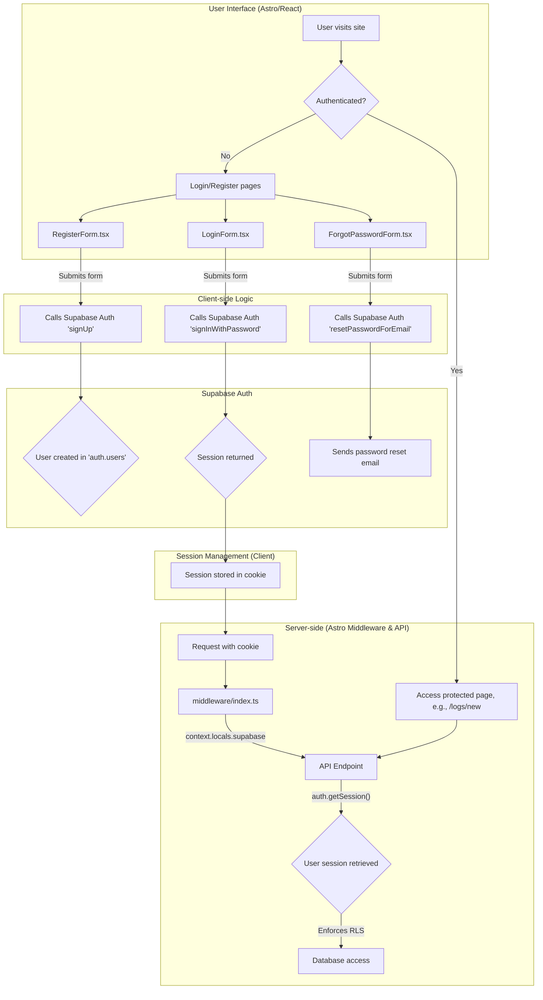

```mermaid
graph TD
    subgraph "User Interface (Astro/React)"
        A[User visits site] --> B{Authenticated?};
        B -- No --> C[Login/Register pages];
        C --> D[RegisterForm.tsx];
        C --> E[LoginForm.tsx];
        C --> F[ForgotPasswordForm.tsx];
    end

    subgraph "Client-side Logic"
        D -- Submits form --> G[Calls Supabase Auth 'signUp'];
        E -- Submits form --> H[Calls Supabase Auth 'signInWithPassword'];
        F -- Submits form --> I[Calls Supabase Auth 'resetPasswordForEmail'];
    end

    subgraph "Supabase Auth"
        G --> J{User created in 'auth.users'};
        H --> K{Session returned};
        I --> L[Sends password reset email];
    end

    subgraph "Session Management (Client)"
        K --> M[Session stored in cookie];
    end

    subgraph "Server-side (Astro Middleware & API)"
        M --> N[Request with cookie];
        N --> O["middleware/index.ts"];
        O -- "context.locals.supabase" --> P["API Endpoint"];
        P -- "auth.getSession()" --> Q{User session retrieved};
        Q -- "Enforces RLS" --> R[Database access];
        B -- Yes --> S[Access protected page, e.g., /logs/new];
    end

    S --> P;
```
