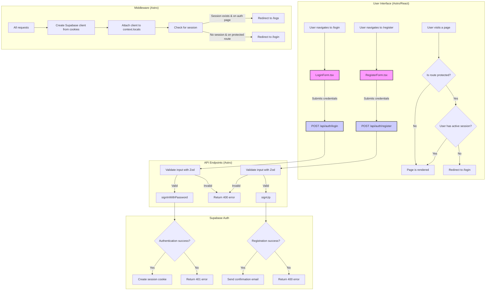

```mermaid
graph TD
    subgraph "User Interface (Astro/React)"
        A[User visits a page] --> B{Is route protected?};
        B -- Yes --> M{User has active session?};
        B -- No --> C[Page is rendered];

        M -- No --> D[Redirect to /login];
        M -- Yes --> C;

        E[User navigates to /login] --> F[LoginForm.tsx];
        F -- Submits credentials --> G[POST /api/auth/login];

        H[User navigates to /register] --> I[RegisterForm.tsx];
        I -- Submits credentials --> J[POST /api/auth/register];
    end

    subgraph "API Endpoints (Astro)"
        G --> K[Validate input with Zod];
        K -- Valid --> L[signInWithPassword];
        K -- Invalid --> N[Return 400 error];

        J --> O[Validate input with Zod];
        O -- Valid --> P[signUp];
        O -- Invalid --> N;
    end

    subgraph "Supabase Auth"
        L --> Q{Authentication success?};
        Q -- Yes --> R[Create session cookie];
        Q -- No --> S[Return 401 error];

        P --> T{Registration success?};
        T -- Yes --> U[Send confirmation email];
        T -- No --> V[Return 400 error];
    end

    subgraph "Middleware (Astro)"
        W[All requests] --> X[Create Supabase client from cookies];
        X --> Y[Attach client to context.locals];
        Y --> Z[Check for session];
        Z -- Session exists & on auth page --> AA[Redirect to /logs];
        Z -- No session & on protected route --> BB[Redirect to /login];
    end

    style F fill:#f9f,stroke:#333,stroke-width:2px
    style I fill:#f9f,stroke:#333,stroke-width:2px
    style G fill:#ccf,stroke:#333,stroke-width:2px
    style J fill:#ccf,stroke:#333,stroke-width:2px
```
